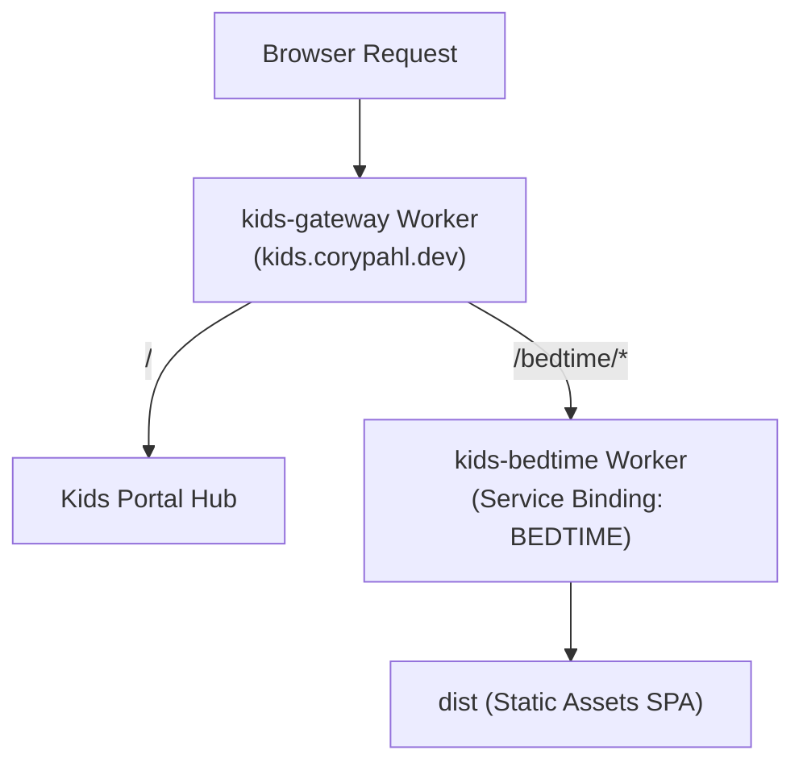

# Architecture

The `kids` monorepo consolidates applications for Emma and Sophie under the unified public domain `kids.corypahl.dev`.

```text
apps/        Browser-facing applications (bedtime, etc.)
services/    Edge routing gateway and supporting services
docs/        Architecture and migration documentation
```

Web applications remain independent Cloudflare projects. Each application owns its build and deployment configuration, while repository-level GitHub Actions workflows use path filters so unrelated applications are not rebuilt unnecessarily.

## Deployment boundaries

Every application and service is an independent deployment target.

- `services/gateway`: Deployed as Cloudflare Worker `kids-gateway`. Owns the public `kids.corypahl.dev` Custom Domain. Routes requests to downstream Workers through Cloudflare Service Bindings without extra network hops.
- `apps/bedtime`: Deployed as Cloudflare Worker `kids-bedtime` with Static Assets (`dist`).



## Routing & Service Bindings

| Public path | Binding | Downstream Worker | Behavior |
| --- | --- | --- | --- |
| `/` | *(Internal)* | — | Renders the kids portal hub landing page |
| `/bedtime` | — | — | Redirects 308 to `/bedtime/` |
| `/bedtime/*` | `BEDTIME` | `kids-bedtime` | Slices `/bedtime` prefix and forwards to `BEDTIME` binding |

Requests forwarded through Service Bindings preserve request headers, query strings, and HTTP methods. The gateway does not handle application logic or rendering beyond the landing hub.
